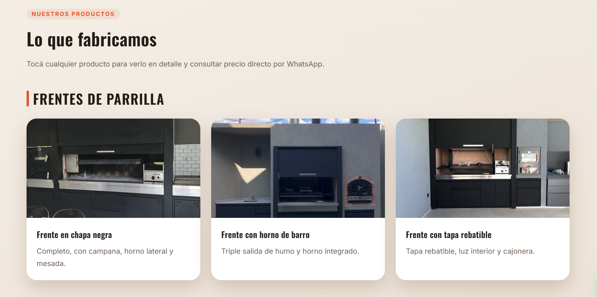
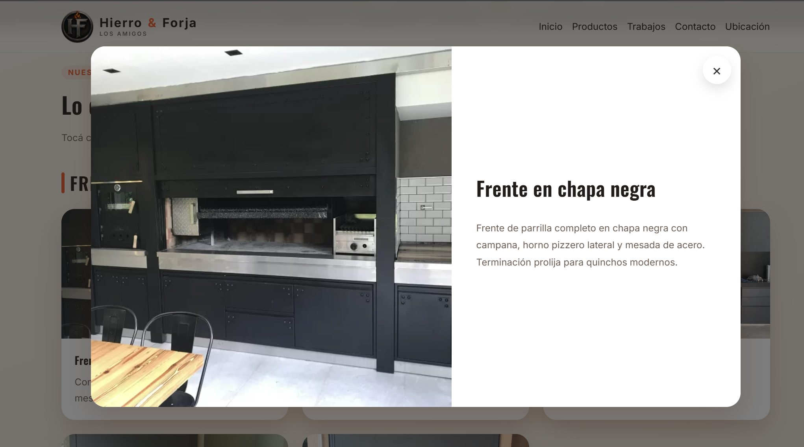
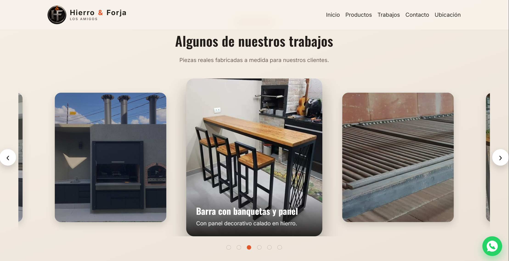
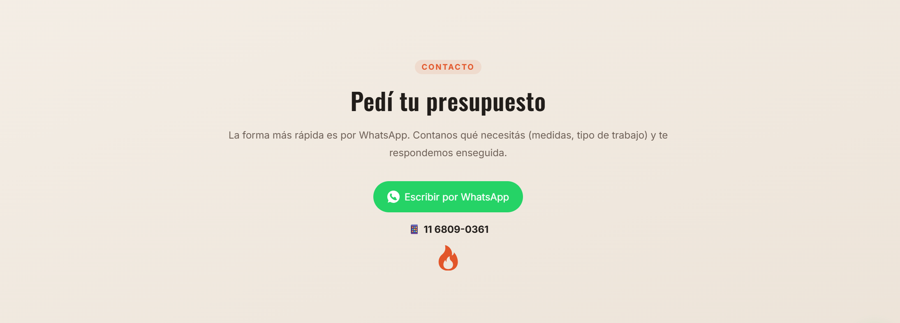
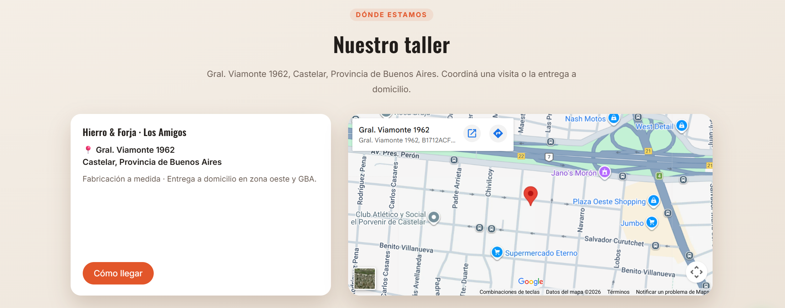
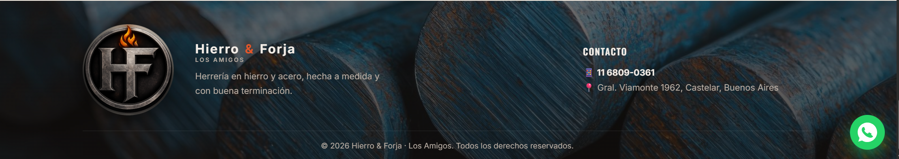
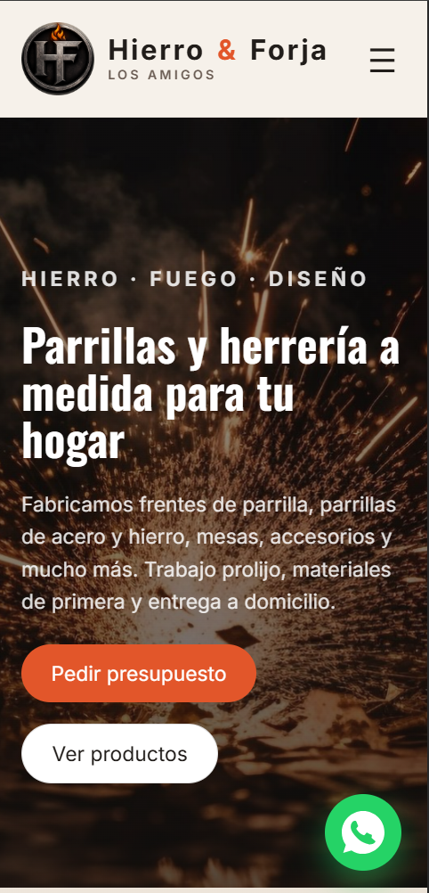

# Hierro & Forja · Los Amigos

Landing page de **Hierro & Forja · Los Amigos**, un taller de herrería y parrillas a medida
ubicado en Castelar, Provincia de Buenos Aires. El sitio muestra los trabajos, los productos
que se fabrican y facilita el contacto directo por WhatsApp para pedir presupuesto.

Es una página **estática** (HTML, CSS y JavaScript puro, sin frameworks ni build), pensada
para ser liviana, rápida y fácil de mantener.

---

## 📸 Capturas

> Guardá las imágenes en la carpeta `capturas/` con estos nombres y se van a ver acá.

### Inicio (Hero)
Presentación con imagen de fondo, título y botones de acción.


### Productos — "Lo que fabricamos"
Grilla de productos por categoría. Al tocar cada uno abre un modal con la foto grande y el detalle.
En celular, cada categoría se convierte en un slider horizontal (swipe).



### Modal de producto
Vista ampliada de un producto (imagen + descripción).



### Destacados — "Algunos de nuestros trabajos"
Carrusel tipo *coverflow* (con Glide.js) en pantallas grandes; slider nativo con scroll en celular.



### Contacto — "Pedí tu presupuesto"
Botón de WhatsApp, número de teléfono e ícono de marca.



### Nuestro taller (Ubicación)
Datos del taller + mapa de Google Maps embebido.



### Footer
Logo, datos de contacto y dirección, con fondo de hierros.



### Versión mobile
Cómo se ve el sitio en celular.



---

## ✨ Funcionalidades

- **Diseño responsive**: se adapta a PC, tablet y celular.
- **Integración con WhatsApp**: botón de contacto, botón flotante y mensajes prearmados por producto.
- **Modal de productos**: al tocar una tarjeta se abre la foto en grande con su descripción.
- **Carrusel de destacados**: efecto *coverflow* con [Glide.js](https://glidejs.com/) en desktop
  y slider nativo con *scroll-snap* en mobile (más cómodo al tacto).
- **Mapa embebido** de Google Maps con la ubicación del taller.
- **Animaciones al hacer scroll** (aparición suave de las secciones).
- **Imágenes optimizadas** para carga rápida.
- **Menú responsive** con botón hamburguesa en celular.

---

## 🗂️ Estructura del proyecto

```
Parrilla/
├── index.html            # Estructura y contenido de la página
├── styles.css            # Todos los estilos
├── script.js             # Lógica: carrusel, modal, menú, WhatsApp, scroll reveal
├── README.md
├── capturas/             # (agregar) capturas de pantalla para este README
├── image/                # Imágenes de productos, hero, footer y logo
│   ├── hero.jpg          # Fondo del hero
│   ├── hierroRedondo.jpg # Fondo del footer
│   ├── logo-emblema.png  # Logo de la marca
│   └── _originales/      # Copias sin comprimir de hero y footer (respaldo)
└── vendor/
    └── glide/            # Glide.js 3.7.1 (librería del carrusel, alojada localmente)
        ├── glide.min.js
        ├── glide.core.min.css
        └── glide.theme.min.css
```

---

## ▶️ Cómo verlo localmente

Al usar rutas relativas y la librería alojada localmente, alcanza con **abrir `index.html`**
en el navegador (doble clic).

> Nota: el **mapa de Google** puede no cargar al abrir con `file://`. Para verlo igual que en
> producción, conviene levantar un servidor local simple:

```bash
python -m http.server 8000
```

Y después entrar a `http://localhost:8000`.

---

## ⚙️ Cómo editar el contenido

- **Número de WhatsApp / teléfono**: al inicio de `script.js`, en la constante `WHATSAPP_NUMBER`
  (formato internacional, ej. `5491168090361`). El número visible está en `index.html`.
- **Dirección y mapa**: en la sección `#taller` de `index.html` (texto del `<iframe>` y del botón "Cómo llegar").
- **Productos**: cada producto es un `<article class="service-card">` en `index.html`, con
  `data-title`, `data-description` y `data-image` (los datos que usa el modal).
- **Imágenes**: se guardan en `image/`. Conviene subirlas ya optimizadas (comprimidas y a un
  tamaño razonable) para que el sitio cargue rápido.
- **Colores de marca**: variables CSS al principio de `styles.css` (`:root`), por ejemplo `--primary`.

---

## 🛠️ Tecnologías

- **HTML5**, **CSS3** y **JavaScript** (ES6) — sin frameworks.
- [**Glide.js 3.7.1**](https://glidejs.com/) — carrusel de destacados (MIT, alojado localmente).
- **Google Fonts** — tipografías *Inter* y *Oswald*.
- **Google Maps** — mapa embebido de la ubicación.

---

© 2026 Hierro & Forja · Los Amigos. Todos los derechos reservados.
